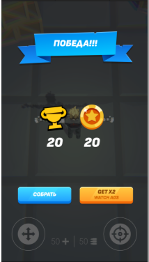

# Unity Game Developer. Basic

Safarov Aleksey
email: safarov-ar@yandex.ru

## Реализация стрельбы

Цель:

- В данном домашнем задании вы реализуете стрельбу.

Описание/Пошаговая инструкция выполнения домашнего задания:

- Повторить стрельбу из урока

Критерии оценки:

- Соблюдение принципов ООП
- Реализация целей ДЗ

Компетенции:

1. Программировать на C# - Использовать корутин в Unity
   Рекомендуем сдать до: 15.02.2026

## Sctiptable Object. Создаем 2 новых оружия

Цель:

- В данном домашнем задании вы создадите оружие.

Описание/Пошаговая инструкция выполнения домашнего задания:

- Создать 2 других типа оружия и конфиги к ним

Компетенции:

1. Работать в редакторе Unity
   - Создавать конфиги с помощью Scriptable Object

## Массивы, коллекции. Переключение оружия

Цель:

- В данном домашнем задании вы реализуете переключение оружия.

Описание/Пошаговая инструкция выполнения домашнего задания:

- Повторить реализацию переключения оружия с урока

Критерии оценки:

- Работоспособность системы
- Правильность использования модификаторов доступа
- Правильность названия методов, полей и класса

Компетенции:

1. Программировать на C#
   - Использовать массивы, коллекции

## Звуки в Unity

Цель:
В данном домашнем задании вы научитесь работать со звуками.

- Скачать проект OTUS-Basic-Shooter
- Желательно использовать версию 6000.0.51f
- Сделать звуки по заданию.
- Проект можно также запаковать в архив и выложить в ДЗ для проверки. Оставив только папки: Assets, Packages, ProjectSettings или запушить на Гит.

Описание/Пошаговая инструкция выполнения домашнего задания:

- Внедрить звуки выстрела при ходьбе, выстреле, прыжке

Критерии оценки:

- Соблюдение принципа ед. ответственности
- Настраиваемость механики
- Работа с корутинами

Компетенции:

1. Программировать на C#
   - Воспроизводить и внедрять звуки через C#

## Программирование интерфейса

Цель:

- В данном домашнем задании вы научитесь программировать игровой интерфейс.

Описание/Пошаговая инструкция выполнения домашнего задания:

- Сверстать и запрограммировать кол-во патрон, кол-во жизней, меню настроек

Компетенции:

1. Работать в редакторе Unity
   - Разработать интерфейс

## Отзывчивость интерфейса

Цель:
- В данном домашнем задании вы научитесь работать с анимациями и звуками в UI.

Описание/Пошаговая инструкция выполнения домашнего задания:
- Выполнить UI по техническому заданию:
[техническое задание](https://docs.google.com/document/d/1SbF7byMKYVr_lrqj0NhVTx6JO5ozBQJf1pMy-PqQk_o/edit?usp=sharing§)

### Домашнее задание
Сделать экран победы по нарисованному макету. Использовать материалы, которые даны к лекции
- Сверстать экран победы по макету
- Сделать появление экрана через анимацию прозрачности. После этого появляются остальные части элементы
   - Заголовок плавно появляется из прозрачности
   - После этого награды по очереди будто падают сверху. Эффект штампа. Это можно сделать с помощью скейла. Скейл с 3 до 1
   - После наград появляются одновременно 2 кнопки. Сделать через увеличение размера и прозрачность. Значения подберите сами 
- Все части анимации после появление экрана должны появляться за одинаковое время
- При нажатии на кнопку Собрать экран скрывается с помощью прозрачности до 0
- При нажатии на вторую кнопку должен выводиться log в консоль, что здесь будет реклама
- Верстка должна адаптироваться под разрешение экрана
- После прохождения уровня, показать менюшку. А также менять кол-во полученных монеток. 1 монетка = 1 блок  

Компетенции:
Работать в редакторе Unity
- Разработать интерфейс
- Создавать звуки и анимации для игрового интерфейса
