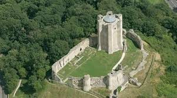
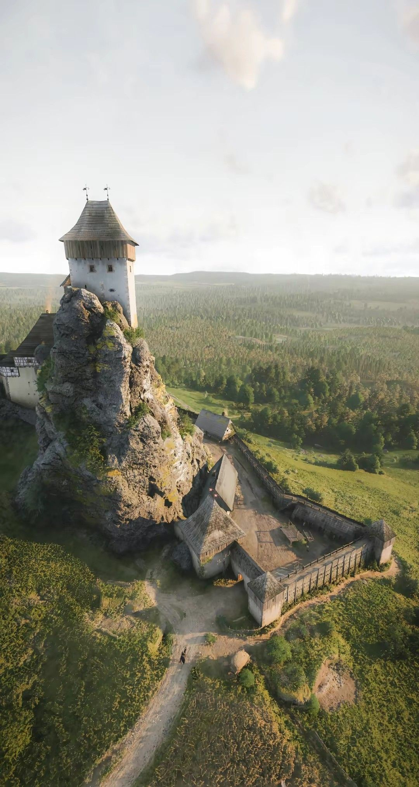
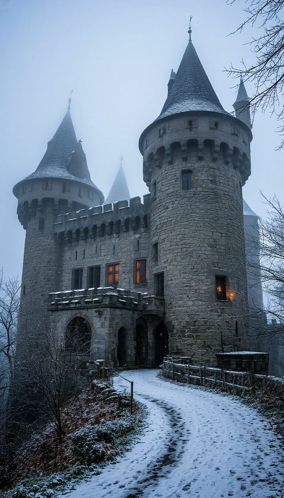
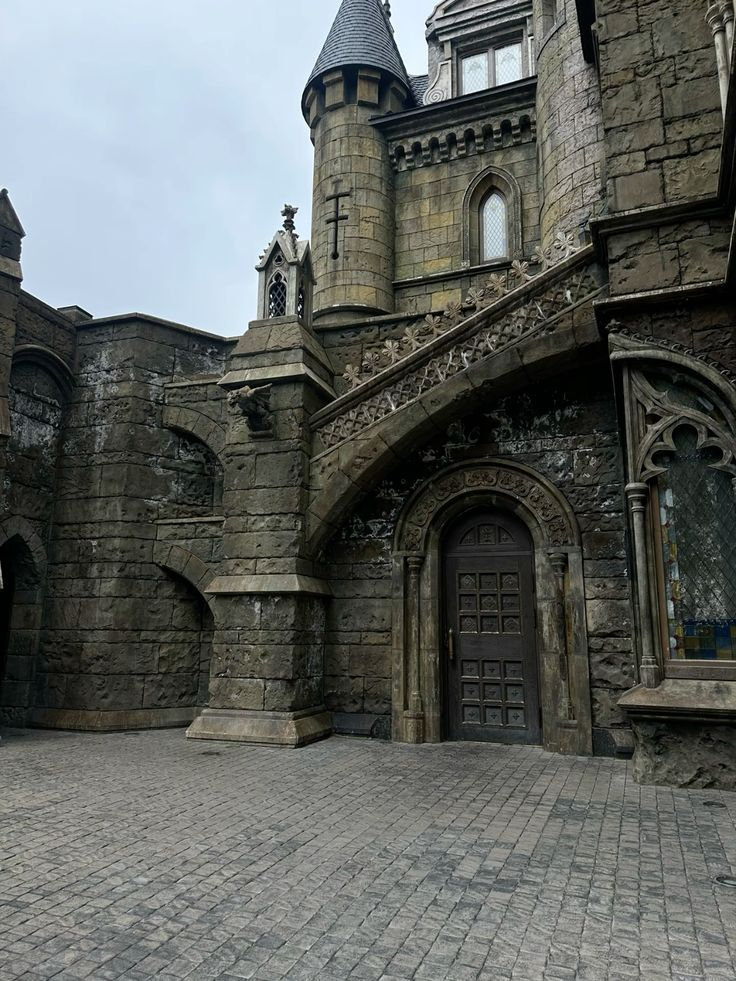
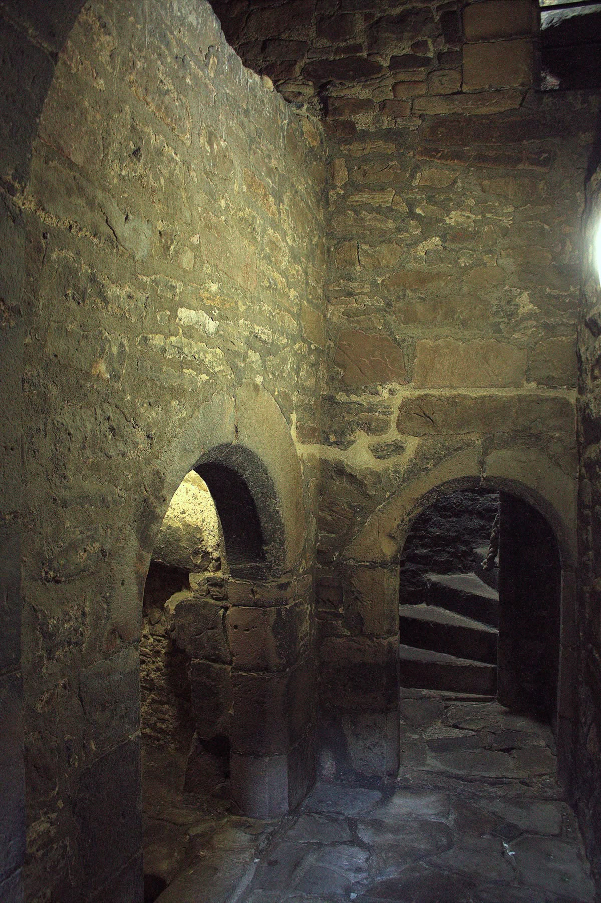
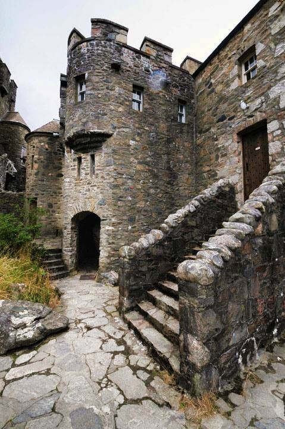
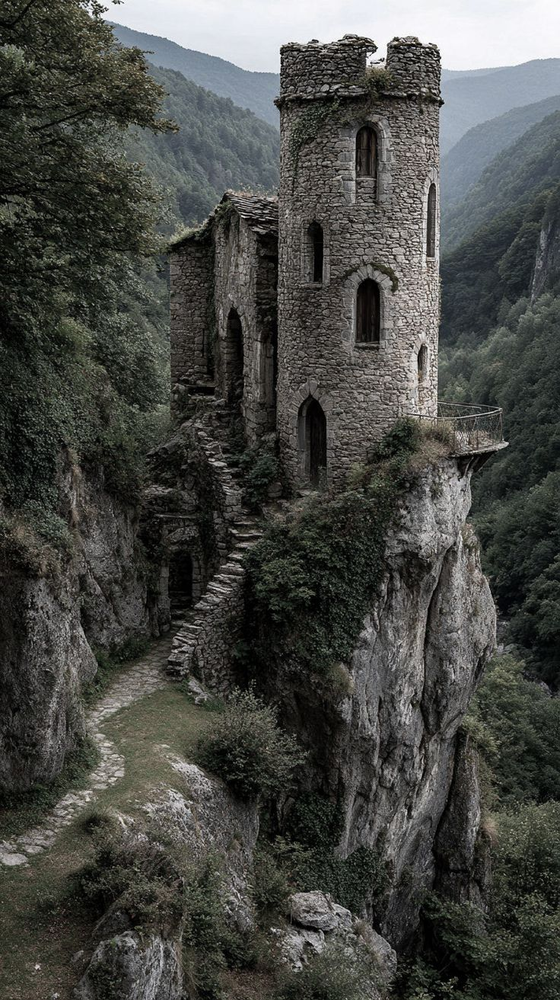
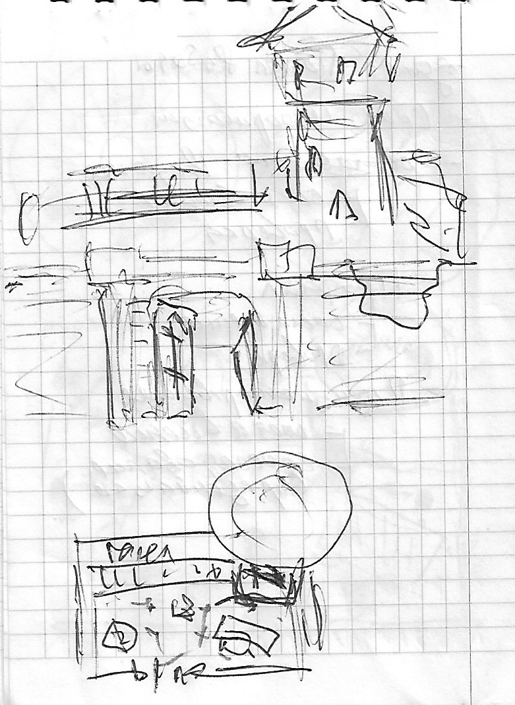
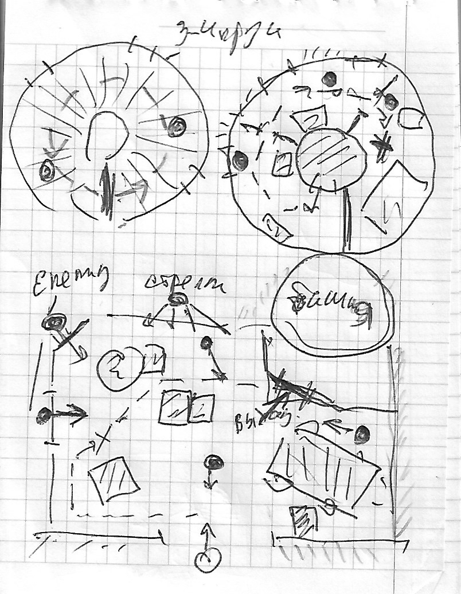

# Unity Game Developer. Basic

Safarov Aleksey
email: safarov-ar@yandex.ru

## Основы левел-дизайна

Цель:
- В данном домашнем задании вы закрепите знания о левел-дизайне и сделаете свой уровень в проекте.

Описание/Пошаговая инструкция выполнения домашнего задания:
- Сделать свой уровень в проекте.

Компетенции:
1. Разрабатывать геймдизайн
   - Знать пайплайн разработки дизайна
   - Понимать значение левел-дизайна

### Дизайна уровня

1. Определение целей игрока на уровне:
   Захват башни:
   - внутренний двор крепости, отражение нападения защитников
   - найти вход в башню
   - подъем по лестнице, сражение с защитниками
   - вход в помещение на вершине башни: сражение с босом или кат сцена

2. Сбор референсов (концепт-арт)

  
  
  
  

3. Floorplan  

4. Blockout (greyboxing)